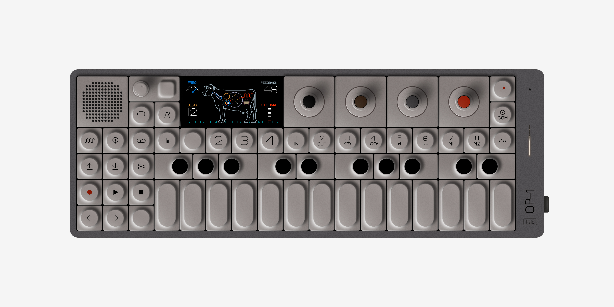
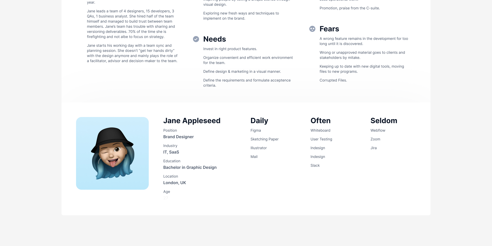
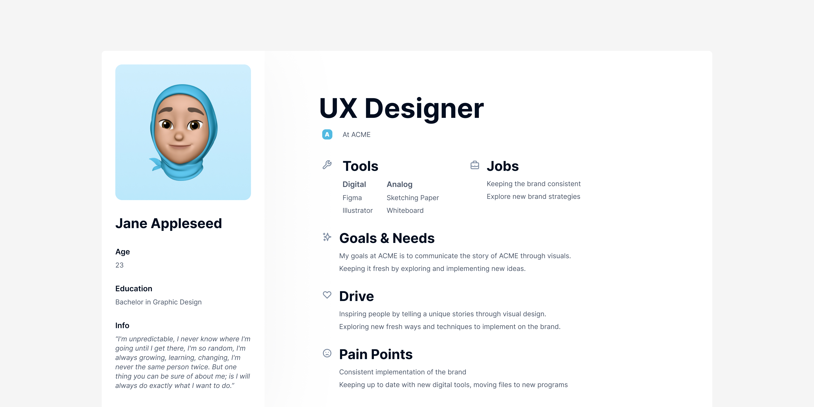
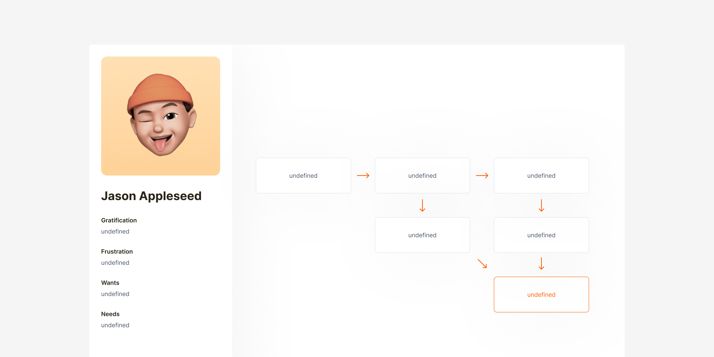

# Open source design files

Open source and free to use Figma designs you can find on my profile [@lorenzo](https://figma.com/@lorenzo) in the Figma community.

## Pitch slides template

[Pitch slides template](https://figma.com/community/file/1433476750478104781) for your next pitch, portfolio or presentation. This file contains 17 layouts made with blocks, so you can smoothly switch between images and text. With progress component at the bottom of your presentation.

Typography used:
- [Inter](https://github.com/rsms/inter) by Rasmus Andersson

Art used in example slides:
- Nine Discourses On Commodus by CY Twombly
- Mimic XR by Kostadin Kostadinov
- Airmax Dotted by Mansoor
- Artwork by Boldtron
- Solar Storm Sculpture by Vincent Leroy
- Artwork by Jakub Geltner
- Pocket Operator by Teenage Engineering
- Big Bang Tourbillon Samuel Ross by Hublot
- let you go. (ascii explorations) by enigmatriz
- Fishing Baits by Thomas Kurppa
- Concrete Stereo by Ron Arad
- The Weather Project by Studio Olafur Eliasson

## teenage engineering OP-XY

[teenage engineering OP-XY](https://figma.com/community/file/1440982544324019665) fully recreated in Figma.

Information about the teenage engineering OP-XY: the new evolution of sequencing. OP–XY is a powerful sequencer, synthesizer, and sampler. stack sounds on a 64-step grid, and create thousands of projects. tactile 24-key keyboard and a multi-out jack that lets you select one of four outputs. 8 unique synth engines, two send effect slots, plus brain™ for transposition—it’s a complete studio in the palm of your hand.

Visit the [teenage engineering OP-XY website](https://teenage.engineering/products/op-xy).

## teenage engineering OP-1 field

[teenage engineering OP-1 field](https://figma.com/community/file/1129880749733211997) fully recreated in Figma.

Information about the teenage engineering OP-1 field: The evolution of the OP–1 synthesizer. inspired by a decade of technological advancements, ideas and improvements, OP–1 field features a new low aluminum frame, field color palette and glass screen.

Visit the [teenage engineering OP-1 field website](https://teenage.engineering/products/op-1).

## Persona template advanced

[Advanced persona template](https://figma.com/community/file/838432318134018290) made with the auto-layout. The layout will adapt to the content of your persona. Containing a dark and light version.

The design is inspired by the article ["Make Your Personas Great Again in 7 Simple Steps"](https://medium.com/design-bridges/personas-e60c1c06ead1) by [Slava Shestopalov](https://x.com/shestopalov_v), contributing writer at [Smashing Magazine](https://smashingmagazine.com).

Recources used:
- [Inter](https://github.com/rsms/inter) by Rasmus Andersson
- [Memojis](https://figma.com/community/plugin/1090391796325905912/memojis) by Max Steitle
- [Boxicons](https://github.com/atisawd/boxicons) by Atisa

## Persona template minimal

[Minimal Persona Template](https://figma.com/community/file/822917064336307885) made with the auto-layout. The layout will adapt to the content of your persona. Containing a dark and light version.

The design is inspired by the article ["A Closer Look At Personas: What They Are And How They Work"](https://smashingmagazine.com/2014/08/a-closer-look-at-personas-part-1) & ["A Closer Look At Personas: A Guide To Developing The Right Ones"](https://smashingmagazine.com/2014/08/a-closer-look-at-personas-part-2) from [Smashing Magazine](https://smashingmagazine.com) by [Shlomo Goltz](https://x.com/MoGoltz).

Recources used:
- [Inter](https://github.com/rsms/inter) by Rasmus Andersson
- [Memojis](https://figma.com/community/plugin/1090391796325905912/memojis) by Max Steitle
- [Heroicons](https://github.com/refactoringui/heroicons) by Steve Schoger

## Flow template

[Flow template](https://figma.com/community/file/828934765007036334) to make flowcharts and user flows.

Assets used:
- [Inter](https://github.com/rsms/inter) by Rasmus Andersson
- [Memojis](https://figma.com/community/plugin/1090391796325905912/memojis) by Max Steitle

#

You can see more of my work on my website on [lorenzodelijser.com](https://lorenzodelijser.com). Feel free to reach out to me through email at [hey@lorenzodelijser.com](mailto:hey@lorenzodelijser.com) or on [X](https://x.com/lorenzodelijser) if you have any questions or feedback.