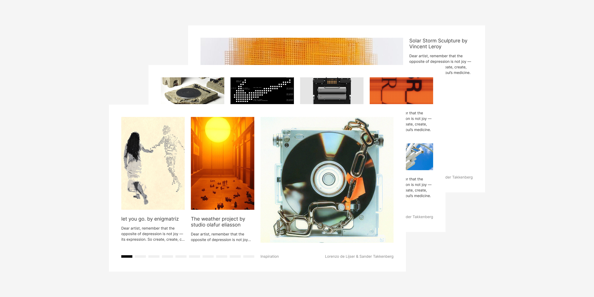
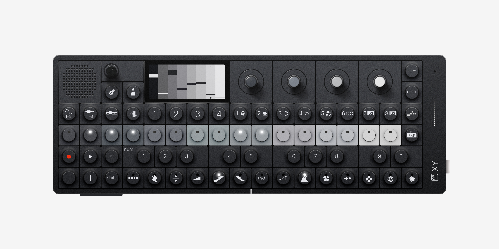
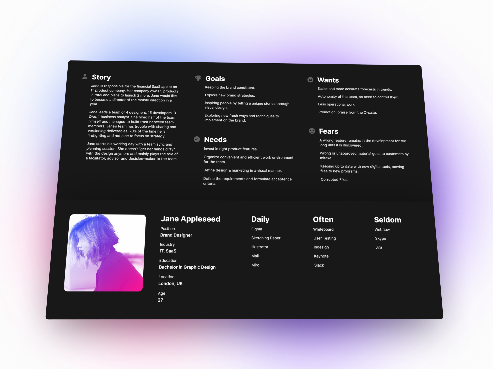
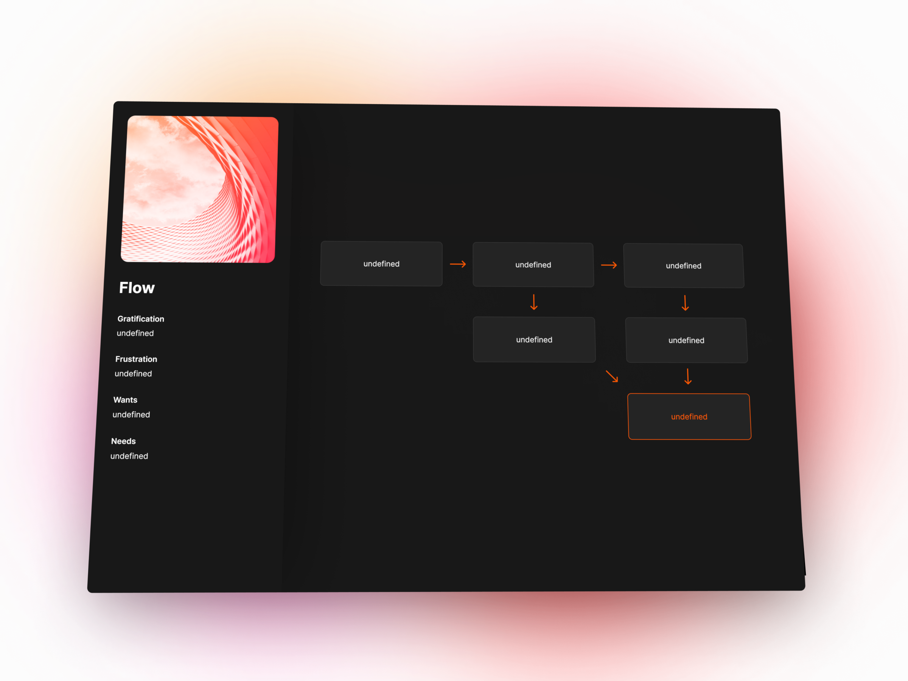

# Open source design files

## Pitch slides template

<a href="https://www.figma.com/community/file/1433476750478104781" role="link" target="_blank" rel="noopener noreferrer">Pitch slides template</a> for your next pitch, portfolio or presentation. This file contains 17 layouts made with blocks, so you can smoothly switch between images and text. With progress component at the bottom of your presentation.

Typography used:
- <a href="https://github.com/rsms/inter" role="link" target="_blank" rel="noopener noreferrer">Inter</a> by Rasmus Andersson

Art used in example slides:
- Nine Discourses On Commodus by CY Twombly
- Mimic XR by Kostadin Kostadinov
- Airmax Dotted by Mansoor
- Artwork by Boldtron
- Solar Storm Sculpture by Vincent Leroy
- Artwork by Jakub Geltner
- Pocket Operator by Teenage Engineering
- Big Bang Tourbillon Samuel Ross by Hublot
- let you go. (ascii explorations) by enigmatriz
- Fishing Baits by Thomas Kurppa
- Concrete Stereo by Ron Arad
- The Weather Project by Studio Olafur Eliasson

## teenage engineering OP-XY

<a href="https://www.figma.com/community/file/1440982544324019665" role="link" target="_blank" rel="noopener noreferrer">teenage engineering OP-XY</a> fully recreated in Figma.

Information about the teenage engineering OP-XY:
the new evolution of sequencing. OP–XY is a powerful sequencer, synthesizer, and sampler. stack sounds on a 64-step grid, and create thousands of projects. tactile 24-key keyboard and a multi-out jack that lets you select one of four outputs. 8 unique synth engines, two send effect slots, plus brain™ for transposition—it’s a complete studio in the palm of your hand.

Visit the teenage engineering OP-XY website:
<a href="https://teenage.engineering/products/op-xy" role="link" target="_blank" rel="noopener noreferrer">https://teenage.engineering/products/op-xy</a>

## Persona Template Advanced

<a href="https://www.figma.com/community/file/838432318134018290" role="link" target="_blank" rel="noopener noreferrer">Advanced Persona Template</a> made with the Auto-Layout. The layout will adapt to the content of your persona.

The design is inspired by the article "Make Your Personas Great Again in 7 Simple Steps" by Slava Shestopalov, contributing writer at Smashing Magazine.

Recources used:
- <a href="https://github.com/rsms/inter" role="link" target="_blank" rel="noopener noreferrer">Inter</a> by Rasmus Andersson
- <a href="https://www.figma.com/community/plugin/738454987945972471/Unsplash" role="link" target="_blank" rel="noopener noreferrer">Unsplash Plugin</a> by Unsplash
- <a href="https://github.com/atisawd/boxicons" role="link" target="_blank" rel="noopener noreferrer">Boxicons</a> by Atisa

## Persona Template Minimal

<a href="https://www.figma.com/community/file/822917064336307885" role="link" target="_blank" rel="noopener noreferrer">Minimal Persona Template</a> made with the Auto-Layout. The layout will adapt to the content of your persona.

The design is inspired by the article "A Closer Look At Personas: What They Are And How They Work" & "A Closer Look At Personas: A Guide To Developing The Right Ones" from Smashing Magazine by Shlomo Goltz.

Recources used:
- <a href="https://github.com/rsms/inter" role="link" target="_blank" rel="noopener noreferrer">Inter</a> by Rasmus Andersson
- <a href="https://www.figma.com/community/plugin/738454987945972471/Unsplash" role="link" target="_blank" rel="noopener noreferrer">Unsplash Plugin</a> by Unsplash
- <a href="https://github.com/refactoringui/heroicons" role="link" target="_blank" rel="noopener noreferrer">Heroicons</a> by Steve Schoger

## Flow Template

<a href="https://www.figma.com/community/file/828934765007036334" role="link" target="_blank" rel="noopener noreferrer">Minimal Flow Template</a> to make flowcharts and user flows.

Assets used:
- <a href="https://github.com/rsms/inter" role="link" target="_blank" rel="noopener noreferrer">Inter</a> by Rasmus Andersson
- <a href="https://www.figma.com/community/plugin/738454987945972471/Unsplash" role="link" target="_blank" rel="noopener noreferrer">Unsplash Plugin</a> by Unsplash

#

Feel free to reach out to me through email at [hey@lorenzodelijser.com](mailto:hey@lorenzodelijser.com) or on [Twitter](https://twitter.com/lorenzodelijser) if you have any questions or feedback.
